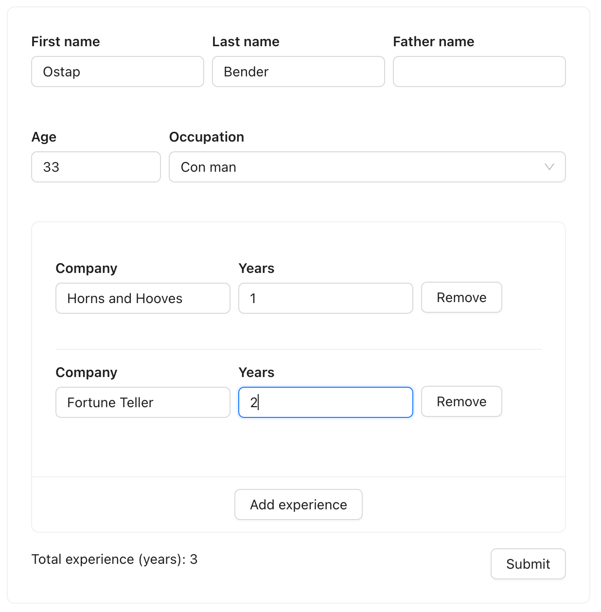
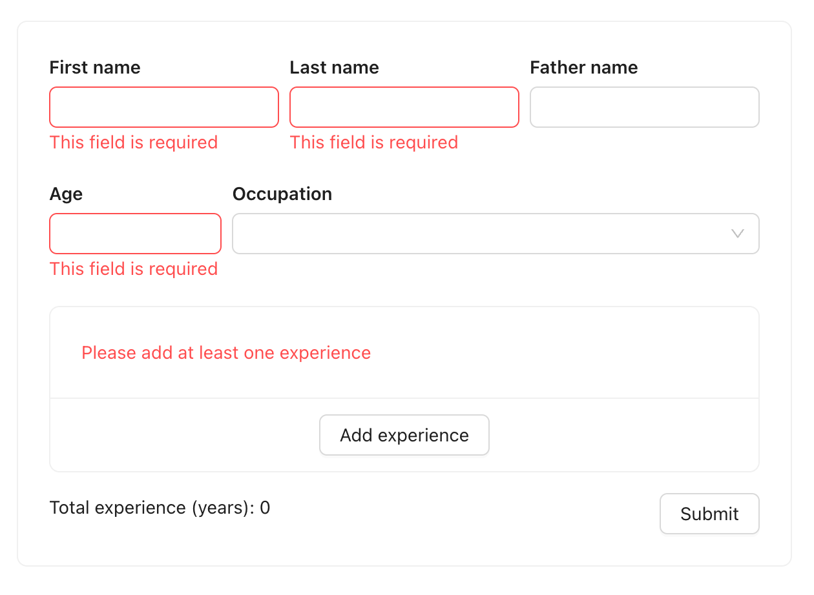
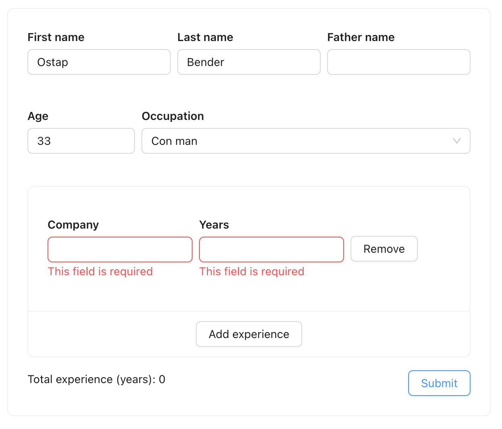

# Nested dynamic form

In this example we'll learn how to create a nested dynamic form with Mobx using `mobx-form-lite`. There is clickable demo in the end of the article. Make sure you have installed all the needed libraries to start:

```bash
npm install mobx-form-lite antd
```

## Task

We'll create a form that allows adding and removing fields dynamically. Fully runnable demo is available at the end of the article.



As well as providing the following rules:

- Name, last name, and age are required
- Age must be a number
- At least one work experience must be provided
- Total experience should be calculated automatically



- Validation should support nested and dynamic fields
- A work experience must have title and years as a number
- Validation should be hidden until the first submit



## Store

Let's start modeling the form. We'll create a `ResumeStore` that will hold the form state:

```typescript
import { makeAutoObservable } from "mobx";
import { ListField, TextField } from "mobx-form-lite";

export type ExperienceItemType = {
  company: TextField<string>;
  years: TextField<string>;
};

export class ResumeStore {
  form = {
    name: new TextField(""),
    lastname: new TextField(""),
    fatherName: new TextField(""),
    age: new TextField(""),
    jobTitle: new TextField(""),
    experience: new ListField<ExperienceItemType>([]),
  };

  constructor() {
    makeAutoObservable(this, {}, { autoBind: true });
  }
}
```

Almost everywhere we've used `TextField`, but for the experience field, we've used `ListField`. `ListField` is a field that holds a list of fields. In our case, it holds a list of `ExperienceItemType`. The type is arbitrary and can be anything you want.

## Validation rules

For the demo we'll write simple validation rules, but you can use any validation library you like:

<<< ../playground/src/examples/antd-dynamic-form-ex/resume-store.ts#validation

<<< ../playground/src/examples/antd-dynamic-form-ex/resume-store.ts#formstore

Note that `validators` is imported from `mobx-form-lite`. Feel free to write your own functions for validator composition.

## Managing experience list

Let's add a function that adds an experience and attaches validation rules:

<<< ../playground/src/examples/antd-dynamic-form-ex/resume-store.ts#createExp

How to use it in the store:

<<< ../playground/src/examples/antd-dynamic-form-ex/resume-store.ts#manageExp

As you can see, the `ListStore` already provides some helper methods to manage an array. How to add experience calculation based on these fields? Since we're using MobX, we can easily calculate the total experience using `computed`:

<<< ../playground/src/examples/antd-dynamic-form-ex/resume-store.ts#sumExp

We only calculate the total experience if all the experience items are valid (field `years` have an integer value). The only thing left is to map the form state to React components.

## Antd components

Let's create `InputField` and `SelectField` components that connect [Antd](https://ant.design/) with `mobx-form-lite`:

<<< ../playground/src/examples/antd-dynamic-form-ex/input-field.tsx
<<< ../playground/src/examples/antd-dynamic-form-ex/select-field.tsx

::: info
You write a field component once to adapt it to your UI kit and then reuse it anywhere in the project. The `mobx-form-lite` will release ready-to-use fields for the popular UI kits in the future.
:::

## Store context

To make the store available in the React components at any level of nesting, we’ll create a separate React context for this purpose. Since forms typically do not need to be global and exist only within a specific page, there is no need to use the singleton pattern.

<<< ../playground/src/examples/antd-dynamic-form-ex/resume-store-context.tsx

## Experience list

Experience list is an array of fields. We can render it like this:

<<< ../playground/src/examples/antd-dynamic-form-ex/experience-list.tsx
<<< ../playground/src/examples/antd-dynamic-form-ex/experience-item.tsx

## Total experience

The total experience is a computed value. It's a separate component to reduce the render count of the main form:

<<< ../playground/src/examples/antd-dynamic-form-ex/total-experience.tsx

## Runnable demo

This is how the root form component looks:

<<< ../playground/src/examples/antd-dynamic-form-ex/resume-form.tsx

We have built a form using Mobx and `mobx-form-lite` that supports nested and dynamic fields. The form is type-safe and can be covered with unit tests without needing to set up a browser environment. We can leverage Mobx’s power and use `computed` on the form state to calculate derived values, as the form state is just an observable.

Enjoy the clickable demo and play with the code below:

<iframe src="https://stackblitz.com/edit/vite-react-ts-4hbtc9?embed=1&view=preview" style="margin-top: 20px" width="100%" height="600px"></iframe>
